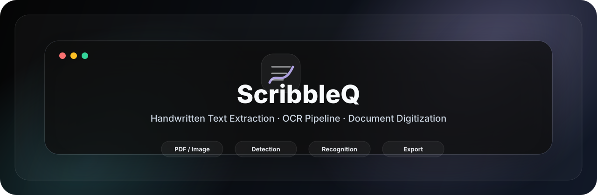
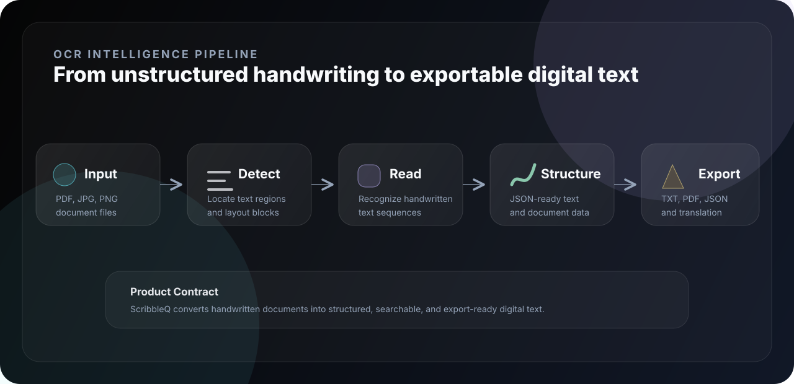
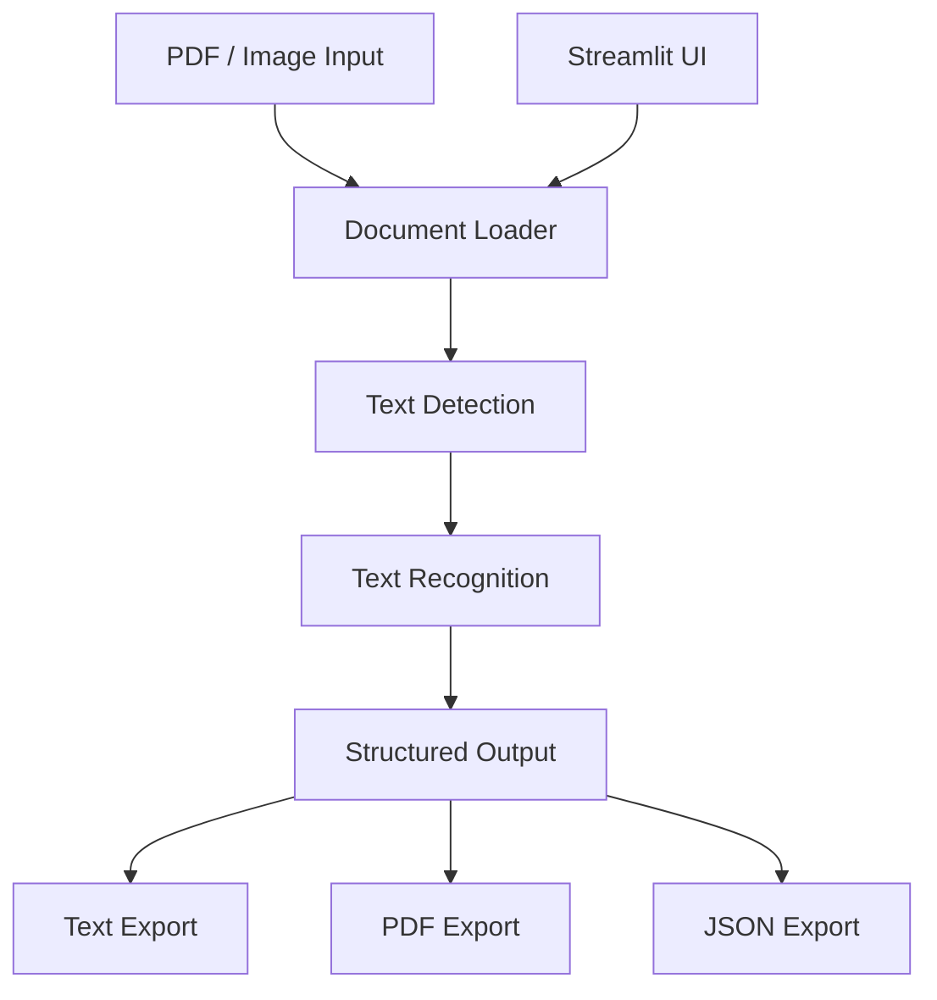
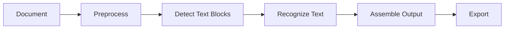

<div align="center">



<br />

<p>
  <strong>Digitize documents.</strong> <strong>Recognize handwritten content.</strong> <strong>Export structured text.</strong>
</p>

<p>
  <code>Python</code> · <code>Streamlit</code> · <code>PyTorch</code> · <code>OCR</code> · <code>Document Processing</code>
</p>

</div>

---

<div align="center">

<table>
<tr>
<td align="center" width="25%"><strong>Type</strong><br />OCR Application</td>
<td align="center" width="25%"><strong>Input</strong><br />PDF / JPG / PNG</td>
<td align="center" width="25%"><strong>Output</strong><br />Text / JSON / PDF</td>
<td align="center" width="25%"><strong>Interface</strong><br />Streamlit</td>
</tr>
</table>

</div>

---

## 01 · Overview

<table>
<tr>
<td width="58%" valign="top">

### Handwritten document digitization system

**ScribbleQ** is an OCR-based document intelligence application for converting handwritten documents into clean digital text.

The system combines document input handling, text-region detection, recognition, structured output, and an interactive Streamlit interface for fast document processing.

</td>
<td width="42%" valign="top">

```text
┌──────────────────────────────┐
│  SCRIBBLEQ OCR CONSOLE       │
├──────────────────────────────┤
│  Input      PDF / Image      │
│  Detect     Text Regions     │
│  Recognize  Handwriting      │
│  Output     Text / JSON      │
│  UI         Streamlit        │
└──────────────────────────────┘
```

</td>
</tr>
</table>

---

## 02 · OCR Pipeline



---

## 03 · System Architecture



---

## 04 · Key Features

| Feature | Purpose |
|---|---|
| Handwritten OCR | Converts handwritten document content into digital text. |
| Multi-format input | Supports PDFs and common image formats. |
| Detection and recognition flow | Separates page analysis from text recognition for cleaner processing. |
| Structured output | Produces data that can be reused in downstream workflows. |
| Export utilities | Supports text, JSON, and PDF-oriented output paths. |
| Streamlit interface | Provides a simple interactive upload and processing experience. |

---

## 05 · AI Workflow



| Stage | Output |
|---|---|
| Input loading | PDF or image document converted into processable pages. |
| Detection | Located text regions and layout blocks. |
| Recognition | Handwritten content converted into digital text. |
| Structuring | Text arranged into export-ready payloads. |
| Export | Text, JSON, or PDF output. |

---

## 06 · Tech Stack

<table>
<tr>
<td width="25%" valign="top">

**Application**

Streamlit  
Python

</td>
<td width="25%" valign="top">

**AI / OCR**

PyTorch  
OCR Models

</td>
<td width="25%" valign="top">

**Vision**

OpenCV  
NumPy  
Matplotlib

</td>
<td width="25%" valign="top">

**Utilities**

FPDF2  
Document Export

</td>
</tr>
</table>

---

## 07 · Installation

```bash
git clone https://github.com/ns7523/ScribbleQ.git
cd ScribbleQ
```

```bash
python -m venv .venv
source .venv/bin/activate
pip install -r requirements.txt
```

For Windows PowerShell:

```powershell
python -m venv .venv
.\.venv\Scripts\Activate.ps1
pip install -r requirements.txt
```

---

## 08 · Usage

Run the Streamlit app:

```bash
streamlit run streamlit_app.py
```

Open the local interface:

```text
http://localhost:8501
```

Python API example:

```python
from hwte.io import DocumentFile
from hwte.models import ocr_predictor

model = ocr_predictor(pretrained=True)
doc = DocumentFile.from_pdf("document.pdf")
result = model(doc)

print(result.export())
```

---

## 09 · Project Structure

```text
.
├── assets/
│   └── brand/
│       ├── hero.svg
│       └── pipeline.svg
├── demo/
│   ├── app.py
│   └── backend/
│       └── pytorch.py
├── hwte/
├── streamlit_app.py
├── requirements.txt
└── README.md
```

Recommended structure:

```text
.
├── assets/
│   ├── brand/
│   └── screenshots/
├── docs/
│   ├── architecture.md
│   ├── ocr-pipeline.md
│   └── deployment.md
├── demo/
├── hwte/
├── tests/
├── examples/
│   ├── input/
│   └── output/
└── requirements.txt
```

---

## 10 · Screenshots & Assets

<table>
<tr>
<td width="50%" valign="top">

### Upload Interface

`assets/screenshots/upload-interface.png`

Streamlit upload and document selection flow.

</td>
<td width="50%" valign="top">

### OCR Result

`assets/screenshots/ocr-result.png`

Recognized text output.

</td>
</tr>
<tr>
<td width="50%" valign="top">

### Export View

`assets/screenshots/export-view.png`

Text, PDF, and JSON export options.

</td>
<td width="50%" valign="top">

### Pipeline View

`assets/screenshots/pipeline-view.png`

Visual overview of detection and recognition stages.

</td>
</tr>
</table>

---

## 11 · Future Improvements

- [ ] Add sample input and output examples.
- [ ] Add OCR accuracy and latency benchmarks.
- [ ] Add screenshots under `assets/screenshots/`.
- [ ] Add deployment notes for Streamlit Cloud.
- [ ] Add tests for input loading and export utilities.
- [ ] Add documentation for OCR model components.
- [ ] Add a clear license file.

---

<div align="center">

### N S Akash

**AI & Cybersecurity Engineer**

[GitHub](https://github.com/ns7523) · [LinkedIn](https://www.linkedin.com/in/nsakash7523) · [Portfolio](https://nsakash.in) · [Email](mailto:nsakash752003@gmail.com)

</div>
