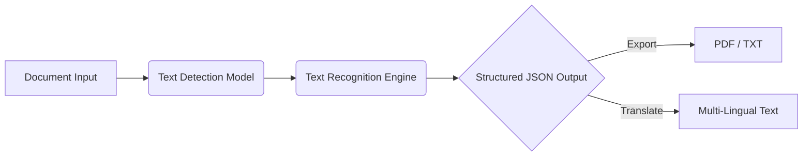

<div align="center">
  <br />
  
  <br />

  <h1 align="center">ScribbleQ (HWTE)</h1>

  <p align="center">
    <strong>Advanced Handwritten Text Extraction & Digitization Architecture.</strong>
  </p>

  <p align="center">
    <a href="https://scribbleq.streamlit.app"></a>
    
    
  </p>
</div>

<br />

## Overview

**ScribbleQ** (Handwritten Text Extraction - HWTE) is an end-to-end Optical Character Recognition (OCR) pipeline designed to extract handwritten text from unstructured documents (PDFs, JPGs, PNGs) and seamlessly digitize it. Built upon a robust PyTorch foundation, the system provides both structural text detection and high-fidelity text recognition, packaged in an interactive Streamlit application.

### Research & Engineering Significance
ScribbleQ addresses the complex challenge of digitizing non-standardized handwriting variations. By utilizing state-of-the-art vision models and transformer-based architectures, the platform significantly reduces transcription overhead while maintaining precision across varied handwriting styles.

<br />

## System Architecture



<br />

## Core Features

- **End-to-End OCR Pipeline**: Integrated Text Detection + Text Recognition for maximal accuracy.
- **Multi-Modal Input Support**: Native processing for both multi-page PDFs and standard image formats.
- **Structured Data Extraction**: Delivers outputs in machine-readable JSON format for downstream NLP tasks.
- **Enterprise Utilities**: Built-in PDF/TXT exports and optional machine translation via `googletrans`.
- **Interactive UI**: Rapid testing environment powered by Streamlit.

<br />

## Tech Stack

| Layer | Technologies |
| --- | --- |
| **Core AI/ML** | PyTorch, Mindee OCR Engine |
| **Computer Vision** | OpenCV, NumPy, Matplotlib |
| **Application Layer** | Streamlit, Python |
| **Utilities** | `fpdf2` (Document Gen), `googletrans` (Translation) |

<br />

## Project Structure

```text
scribbleq/
├── demo/
│   ├── app.py
│   ├── DejaVuSans.ttf
│   └── backend/
│       └── pytorch.py
├── hwte/                   # Core OCR modeling and I/O logic
├── streamlit_app.py        # Streamlit entry point
└── requirements.txt
```

<br />

## Quick Start

### Python API Integration

ScribbleQ can be integrated directly into larger data processing pipelines.

```python
from hwte.io import DocumentFile
from hwte.models import ocr_predictor

# Initialize the pre-trained OCR model
model = ocr_predictor(pretrained=True)

# Load document into memory
doc = DocumentFile.from_pdf("path/to/your/document.pdf")

# Execute inference
result = model(doc)

# Export structured JSON payload
json_output = result.export()
print(json_output)
```

<br />

## Roadmap & Future Enhancements

- [ ] Implementation of custom fine-tuned weights for domain-specific handwriting (e.g., medical prescriptions).
- [ ] Optimization of inference latency for edge deployment.
- [ ] Advanced layout analysis for complex multi-column documents.

<br />

## Acknowledgements & Usage Policy

- **Core OCR Engine**: Built utilizing open-source models originally developed by Mindee.
- **License**: This repository is proprietary and published strictly for learning and demonstration purposes. Viewing is permitted, but copying, modifying, or redistributing the code is prohibited.

<div align="center">
  <br />
  <sub>Architected by <a href="https://github.com/ns7523">N S AKASH (@craftiq)</a> • AI & ML Engineer</sub>
</div>
